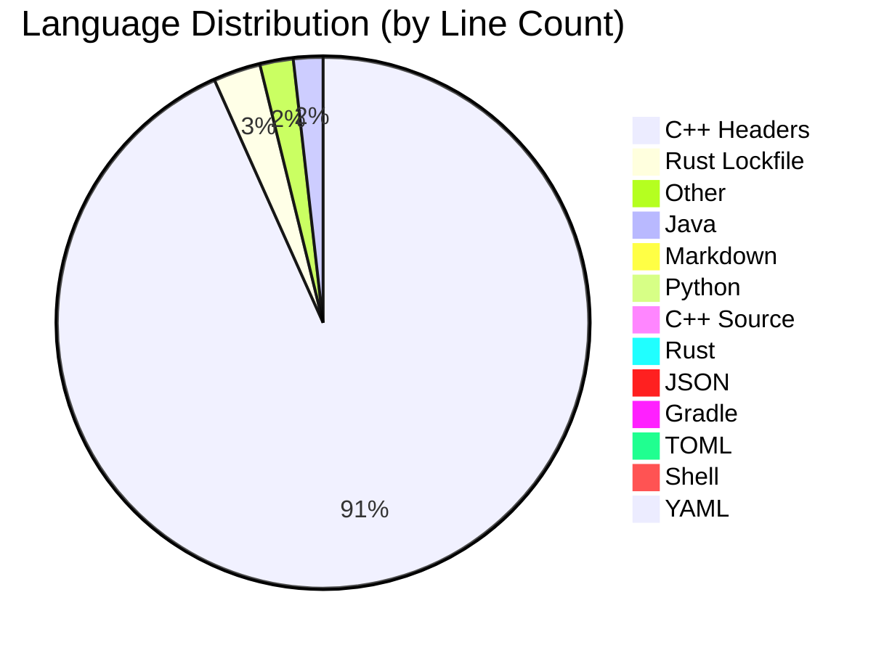

# 📊 Repository Language Breakdown

A comprehensive analysis of the languages that power this codebase.

## 🧱 Codebase Composition

## 📈 Detailed Metrics

| Language | Extensions | File Count | Line Count |
| :--- | :--- | :--- | :--- |
| **C++ Headers** | `.h, .hpp, .inc` | 324 | 167,076 |
| **Rust Lockfile** | `.lock` | 2 | 5,146 |
| **Other** | `.bat, .gitignore, .html, .jar, .properties, .txt` | 14 | 3,626 |
| **Java** | `.java` | 32 | 3,208 |
| **Markdown** | `.md` | 9 | 1,023 |
| **Python** | `.py` | 7 | 946 |
| **C++ Source** | `.cpp` | 2 | 942 |
| **Rust** | `.rs` | 3 | 875 |
| **JSON** | `.json` | 20 | 856 |
| **Gradle** | `.gradle` | 2 | 198 |
| **TOML** | `.toml` | 2 | 31 |
| **Shell** | `.sh` | 1 | 18 |
| **YAML** | `.yml` | 1 | 5 |

> [!NOTE]
> This breakdown is automatically generated. The heavy count of `.h` files is often due to external libraries included in the repository.

---
*Last updated on 2026-03-14*
